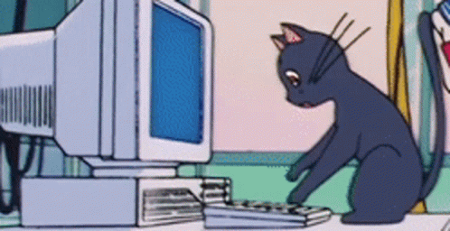

<h1> Hello, I'm Niko ~</h1>
<table>
  
  <tr>
    <td>
      
    </td>
    <td>
      I'm a VR Developer for a research lab at KSU. I work on both low-level, manually managed memory applications in computer graphics and multimedia using C++, as well as video game development and virtual reality with Unity and Unreal Engine.
    </td>
  </tr>
</table>

<!--
**nicholaswile/nicholaswile** is a ✨ _special_ ✨ repository because its `README.md` (this file) appears on your GitHub profile.

Here are some ideas to get you started:

- 🔭 I’m currently working on ...
- 🌱 I’m currently learning ...
- 👯 I’m looking to collaborate on ...
- 🤔 I’m looking for help with ...
- 💬 Ask me about ...
- 📫 How to reach me: ...
- 😄 Pronouns: ...
- ⚡ Fun fact: ...
-->
