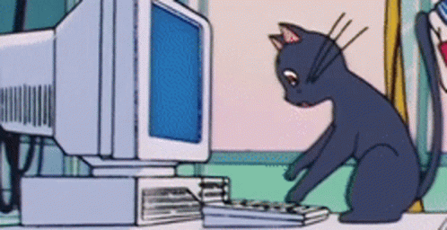

# Hello, I'm Nicho ~

i program with C++, C#, and Python; develop immersive multimedia with Unity and Unreal Engine; model and animate with Autodesk Maya; and write research papers (recently published in IEEE)! i'm a CS postgrad and research assistant.

my favorite projects to work on include video game demos, simulations, 3D computer graphics, and AR/VR/MR. i’m also interested in game engines, game console emulators, machine learning, computer vision, and NLP.
<!--
|  | 
I work on both low-level, manually managed memory applications in computer graphics and multimedia using C++, as well as video game development and virtual reality with Unity and Unreal Engine.
 |
|:---:|:---|

<!--

 
Skilled in C++, C#, Python, Unity, Unreal Engine, OpenGL...
**nicholaswile/nicholaswile** is a ✨ _special_ ✨ repository because its `README.md` (this file) appears on your GitHub profile.

Here are some ideas to get you started:

- 🔭 I’m currently working on ...
- 🌱 I’m currently learning ...
- 👯 I’m looking to collaborate on ...
- 🤔 I’m looking for help with ...
- 💬 Ask me about ...%
- 📫 How to reach me: ...
- 😄 Pronouns: ...
- ⚡ Fun fact: ...
-->
